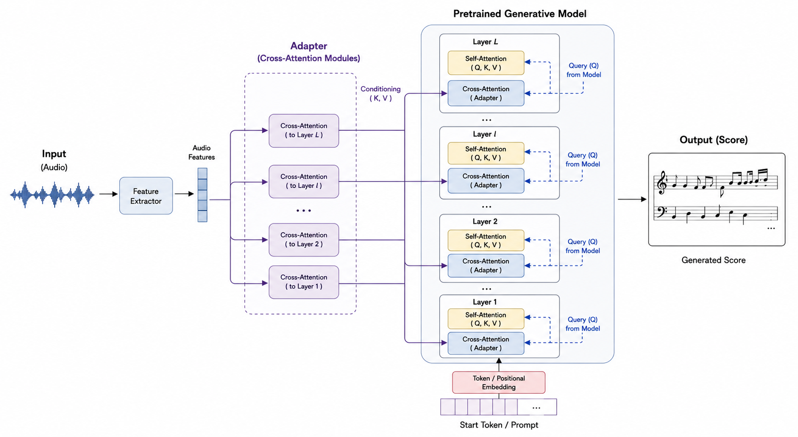

<h1 align='center'>Feature-Conditioned Steering of Pretrained Generative Models for Music Transcription</h1>

<p align='center'>
  
  
  
  
</p>


<p align='center'>
  <a href='#about'>About</a> •
  <a href='#how-to-use'>How To Use</a> •
  <a href='#citations'>Citations</a> •
  <a href='#acknowledgments'>Acknowledgments</a> •
  <a href='#license'>License</a>
</p>

## About
Music transcription can be viewed as a sequence-to-sequence translation task in which the sequences are often represented in different modalities:

- Audio → Score (Transcription)
- PMIDI → Score (Quantization + Engraving)
- Score MIDI → Score (Engraving)

Recent advances in music generative modeling have produced models with substantial knowledge of musical structure. We investigate whether this knowledge can be leveraged for music transcription by steering pretrained generative models in their latent space using feature-based conditioning. The conditioning features can be extracted from audio, performance MIDI, or quantized MIDI.

We apply this approach to monophonic instruments and demonstrate its feasibility, with a particular focus on settings where large amounts of paired training data are unavailable.

More broadly, understanding how to navigate the latent spaces of pretrained generative models may provide a way to leverage their learned musical knowledge for transcription and related symbolic-music tasks, particularly in low-data regimes.

<p align="center">
  
</p>


## How To Use
First, you will need to extract the datasets for training. Follow the instructions in the README.md file in the `catalog` directory.

To extract features for training, run the following:
```
python extract.py
```

For training, run:
```
python train.py
```

For inference, run:
```
python inference.py
```

Feel free to modify the config files in the `gin_configs\` directory. Also, note that some of these files can take in command-line arguments as well.

## Citations

```bibtex
@inproceedings{None,
  title     = {{Feature-Conditioned Steering of Pretrained Generative Models for Music Transcription}},
  author    = {Chukwuemeka Nkama, Andreas Poltioneri, Xavier Serra, and Martin Rocamora},
  booktitle = {{Proceedings of the 52nd International Conference on Acoustics, Speech and Signal Processing}},
  year      = {2027},
  publisher = {IEEE},
  address   = {Toronto, Canada},
  month     = {may},
}
```

## Acknowledgments
This work has been supported by IA y Musica: C ´ atedra en Inteligencia Artificial y Musica (TSI-100929-2023-1), funded by the Secretar´ıa de Estado de Digitalizacion e Inteligencia Artificial and the European Union-Next Generation EU.

## License

This work is under a [MIT](LICENSE) license.
